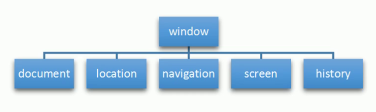

# BOM
客户端JavaScript的存在使得静态的HTML文档编程了交互式的web应用。脚本化HTML页面内容是JavaScript的核心目标。

## BOM是什么
- BOM是Browser Object Model的缩写，翻译为“浏览器对象模型”。
- 浏览器对象模型为浏览器提供了运行JavaScript的上下文。
- BOM允许JS和浏览器对话。ECMAScript的一种扩展、与浏览器交互的一种方式方法。
- BOM把浏览器看成是一个对象模型。在BOM眼中：
    - window: 窗口是就window对象
    - screen: 显示窗口的屏幕就是screen对象
    - location: 窗口的地址栏就是location对象
    - histroy: 窗口的历史记录就是history对象
    - navigation: 窗口的导航面板就是navigation对象
    - document: 窗口中的文档就是document对象
- BOM尚未被标准化。




### BOM和JavaScript的关系
请思考如何在web浏览器中呈现web页面？

- 文档：就是呈现静态信息的页面；
- 应用：加入JavaScrpt的文档就是应用。因为客户端JavaScript的存在使得静态的HTML文档编程了交互式的web应用。

### BOM和DOM对比

|noname|BOM|DOM|
|-|-|-|
|含义|浏览器对象模型|文档对象模型|
|对象|把文档内容看成对象|把浏览器看成对象|
|核心|核心对象是Window|核心对象是Document|
|用途|与窗口交互|与文档交互|
|标准化|未标准化|W3C|

## window对象
window对象表示浏览器的一个窗口，它有双重角色：

- window对象是JavaScript访问浏览器窗口的一个接口。
    - window.document
    - window.location
    - window.history
    - window.navigation
    - window.screen
- window对象也是全局对象。它处于作用域链的顶部，定义在全局作用域中的变量和函数都会自动成为window对象的属性和方法。

示例1：遍历window对象
```html
<body>
    <ol></ol>
    <script>
        let str = ''
        let oOl = document.querySelector('ol')
        for(attr in window){
            str += `<li>${attr}: ${window[attr]}</li>`
        }
        oOl.innerHTML = str //FF: 225个属性  Chrom:221个属性
    </script>
</body>

```
示例2：全局作用域下的变量和函数自动成为window对象的属性和方法
```javascript
var n1 = 10
let n2 = 20
const n3 = 30
function fn() {
    console.log('hello world')
}
console.log(window.n1) // 10
console.log(window.n2) // undefined
console.log(window.n3)  // undefined
```

### 关于窗口
- 一个浏览器窗口可能包含多个标签页。
- 每个标签页都是独立的“浏览上下文”，都有独立的window对象。和其他窗口没有任何联系。
- 由于同源策略的限制，导致窗口之间无法直接交互

### 三种弹框
- `Window.alert()` - 弹出警示框(一条消息+按钮)
- `Window.confirm(['确认信息'])` - 弹出确认框。返回值: true/false
- `Window.prompt('提示信息',['默认输入文本'])` - 显示提示对话框。返回值：用户输入的字符串

示例3：记住三种方法的含义、参数、返回值
```html
<button>警示框</button> <button>确认框</button> <button>提示对话框</button>
    <p class="box"></p>
    <script>
        const aBtn = document.querySelectorAll('button')
        const oBox = document.querySelector('.box')
        aBtn[0].onclick = function(){
            alert('夜深了，快睡觉吧！')
        }
        aBtn[1].onclick = function(){
            const result = confirm('确认删除吗?')
            if(result){
                oBox.innerHTML = '文件已经删除'
            } else {
                oBox.innerHTML = '文件未删除'
            }
        }
        aBtn[2].onclick = function(){
            const result = prompt('请输入大名','在这里输入')
            if(result != null){
                oBox.innerHTML = `你好！${result}`
            } 
        }
    </script>
```
### 查询视口尺寸
- `window.innerHeight`: 返回窗口的内部/视口高度，包括水平滚动条的高度。
- `window.innerWidth`: 返回窗口的内部/视口宽度，包括水平滚动条的高度。


- 视口尺寸(无单位) = 可视内容尺寸 + 内边距
- Element.clientWidth: 返回元素的可视内容宽度
- Element.clientHeight: 返回元素的可视宽度
- document.documentElement.clientWidth
- document.documentElement.clientHeight

### 查询文档滚动距离
- window.pageYOffset: 判断滚动条的滚动距离（IE8不能用）
- window.pageXOffset: 判断滚动条的滚动距离（IE8不能用）
- `Window.scrollX` - Read only. Returns the number of pixels that the document has already been scrolled horizontally.
- `Window.scrollY` - Read only. Returns the number of pixels that the document has already been scrolled vertically.

### 获取当前窗口
- `Window.window` - Read only. Returns a reference to the current window.
### 查询/设置窗口名字
- `Window.name` - Gets/sets the name of the window.
### 打开一个窗口
- `window.open()` - open a new window
### 关闭一个窗口
- `window.close()` - close the current window
### 查询窗口是否全屏
- `Window.fullScreen` - This property indicates whether the window is displayed in full screen or not.

### 打开控制台
- `Window.console` - Read only. Returns a reference to the console object which provides access to the browser's debugging console.
### 查询像素比
- `Window.devicePixelRatio` - Read only. Returns the ratio between physical pixels and device independent pixels in the current display.
### 获取本地存储对象
- `Window.localStorage` - Read only. Returns a reference to the local storage object used to store data that may only be accessed by the origin that created it.
### 获取当前事件对象
Window.event  Read only
Returns the current event, which is the event currently being handled by the JavaScript code's context, or undefined if no event is currently being handled. The Event object passed directly to event handlers should be used instead whenever possible.


### window.orientation

```html
<script>
//方法四：是侦测屏幕方向，手机屏幕可以随时改变方向（横屏或竖屏），桌面设备做不到。window.orientation属性用于获取屏幕的当前方向，只有移动设备才有这个属性，桌面设备会返回undefined。
    if (typeof window.orientation !== 'undefined') {
       console.log('当前设备是移动设备')  //iPhone 的 Safari 浏览器不支持该属性。
    }
</script>
```

### 设置窗口聚焦
Window.focus()
Sets focus on the current window.
### 设置窗口blur
Window.blur()
Sets focus away from the window.

### 设置文档滚动位置
- Window.scroll()
Scrolls the window to a particular place in the document.
- Window.scrollTo()
Scrolls to a particular set of coordinates in the document.

### 查询计算样式
Window.getComputedStyle()
Gets computed style for the specified element. Computed style indicates the computed values of all CSS properties of the element.

### 动画
- Window.requestAnimationFrame()
Tells the browser that an animation is in progress, requesting that the browser schedule a repaint of the window for the next animation frame.
- Window.cancelAnimationFrame() 
Enables you to cancel a callback previously scheduled with Window.requestAnimationFrame.

## location对象
- location接口表示当前窗口相关的URL地址。
- window.loaction:查询或设置当前window对象相关的location接口
- document.location: 查询或设置当前document对象相关的location接口

### 关于URL
- `https://example.org:8080/foo/bar?q=baz#bang`
- `url`: 统一资源定位符
- `https:`: 协议
- `example.org:8080`: 主机
- `example.org`: 主机名
- `8080`: 端口号
- `/foo/bar`: 路径
- `?q=baz`: 查询
- `#bang`: hash

### Location.href
-  `Location.href`: 返回与文档相关联的url地址(字符串类型）。

示例:新浪网404自动跳转首页
```html
<p></p>
    <script>
        const p = document.querySelector('p')
        let timer = null
        let n = 5
        timer = window.setInterval(function(){
            if(n == 0){
                window.location.href = `http://www.sina.com.cn`
                clearInterval(timer)
            }
            p.innerHTML = `您将在${n}秒钟后跳转到首页`
            n--
        },1000)
    </script>
```
### location.replace()
`Location.replace()` - 用提供的 URL 替换当前资源（重定向到提供的 URL）。与 assign() 方法和设置 href 属性的区别在于，使用 replace() 后当前页面不会保存在 session History 中

示例：replace()跳转
```html
 <script>
    document.querySelector('button').addEventListener('click',function(){
        window.location.replace('http://www.baidu.com')
    })
</script>
```
### location.assign()

- `Location.assign()`- 根据参数中提供的 URL 加载资源

示例：assign()跳转
```html
<script>
    document.querySelector('button').addEventListener('click',function(){
        window.location.assign('http://www.baidu.com')
    })
</script>
```

### location.reload()

`Location.reload()`- 重新加载当前 URL，如刷新按钮

示例：重载页面
```html
<script>
    document.querySelector('button').addEventListener('click',function(){
        // window.location.replace('http://www.baidu.com')
        location.reload()
    })
</script>
```


### location.search

`Location.search` - USVString 是否包含“？”后跟 URL 的参数或“查询字符串”。现代浏览器提供 URLSearchParams 和 URL.searchParams 以便于从查询字符串中解析出参数

示例：登录跳转：login.html
```html
<label for="username">Username</label>
    <input type="text" id="username" spellcheck="false">
    <label for="password">Password</label>
    <input type="password" id="password">
    <button type="submit" id="btn-submit">Login</button>
    <script>
        const oInput1 = document.getElementById('username')
        const oInput2 = document.getElementById('password')
        const oBtn = document.getElementById('btn-submit')
        oBtn.addEventListener('click', function () {
            location.href = `index.html?username=${oInput1.value}&password=${oInput2.value}`
        })
    </script>

```
登录跳转：index.html
```html
<p></p>
    <script>
        const oP = document.querySelector('p')
        const params = location.search.substr(1)
		let params_arr = params.split('&');
        let str = ''
        console.log(params_arr)
		for(let i = 0; i < params_arr.length; i++) {
			let pair = params_arr[i].split('=');
			str += `${pair[0]}: ${pair[1]}  `
		}
        oP.innerHTML = str
    </script>
```


- `Location.hash`- 是一个包含“#”的 USVString，后跟 URL 的片段标识符
- `Location.protocol`: 是一个包含 URL 协议方案的 USVString，包括最后的 ':'
- `Location.host`:是一个包含主机的 USVString，即主机名、':' 和 URL 的端口
- `Location.hostname` - 是一个包含 URL 域的 USVString
- `Location.port` - 是一个包含 URL 端口号的 USVString
- `Location.pathname` - 一个包含初始 '/' 后跟 URL 路径的 USVString，不包括查询字符串或片段

## history对象
`history`接口允许操作浏览器的的历史记录。

### window.history
 `window.history` - Returns a reference to the history object.获取历史记录对象。

### history.length

`history.length` - 查询历史记录对象的长度。 Read only. 
- 参数：无
- 返回值：返回一个表示会话历史中元素数量的整数，包括当前加载的页面。例如，对于在新选项卡中加载的页面，此属性返回 1

### history.back()

后退一页 此异步方法转到会话历史记录中的上一页，与用户单击浏览器的后退按钮时的操作相同。等价于 history.go(-1)
- 参数：无
- 返回值：无

### history.forward()

前进一页。这个异步方法转到会话历史中的下一页，与用户单击浏览器的前进按钮时的操作相同；这相当于 history.go(1)
- 参数：无
- 返回值：无

### history.go()

跳转到指定页面。从会话历史记录中异步加载页面，由其与当前页面的相对位置标识，例如 -1 表示上一页或 1 表示下一页。如果您指定一个超出范围的值(例如，当会话历史记录中没有以前访问过的页面时指定 -1)这种方法静默没有效果。调用不带参数或值为 0 的 go() 会重新加载当前页面。 Internet Explorer 允许您指定字符串而不是整数，以转到历史列表中的特定 URL。
- 参数：整数
- 返回值：无

示例：历史记录跳转

```html
<p>历史记录中有<span></span>条记录</p>
<button>后退</button> <button>前进</button>  <button>跳转到</button><input type="text">
<script>
    console.log(window.history)
    const btn1 = document.querySelectorAll('button')[0]
    const btn2 = document.querySelectorAll('button')[1]
    const btn3 = document.querySelectorAll('button')[2]
    const input = document.querySelector('input')
    const span = document.querySelector('span')
    btn1.addEventListener('click',function(){
        history.back()
    })

    btn2.addEventListener('click',function(){
        history.forward()
    })

    btn3.addEventListener('click',function(){
        console.log(input.value*1)
        history.go(input.value*1) 
    })
    span.innerHTML = history.length
</script>
```

## navigator对象
`Navigator`接口表示用户代理的状态和身份。它允许脚本查询它并注册自己以进行某些活动。可以使用只读的 window.navigator 属性检索 Navigator 对象。

### navigator.userAgent

示例：检测浏览器的方法
```html
<script>
      let userAgent = navigator.userAgent;
      let browser;
      if(userAgent.match(/edg/i)){
        browser = "edge";
      }else if(userAgent.match(/firefox|fxios/i)){
        browser = "firefox";
      }else if(userAgent.match(/opr\//i)){
        browser = "opera";
      }else if(userAgent.match(/chrome|chromium|crios/i)){
        browser = "chrome";
      }else if(userAgent.match(/safari/i)){
        browser = "safari";
      }else{
        alert("Other browser");
      }
      const logo = document.querySelector(`.logos .${browser}`);
      if(logo){
        logo.style.opacity = "1";
      }
    </script>
```
>检测手机浏览器，最简单的方法就是分析浏览器的 useragent 字符串，它包含了设备信息。JS 通过navigator.userAgent属性拿到这个字符串，只要里面包含mobi、android、iphone等关键字，就可以认定是移动设备。

示例：检测手机浏览器

```html
<script>
    //方法一
        if (/Mobi|Android|iPhone/i.test(navigator.userAgent)) {
            console.log('当前设备是移动设备')
        } else {
            console.log('当前不是移动设备')
        }

    // 方法二
        if (
            navigator.userAgent.match(/Mobi/i) ||
            navigator.userAgent.match(/Android/i) ||
            navigator.userAgent.match(/iPhone/i)
        ) {
            console.log('当前设备是移动设备')
        }else {
            console.log('当前不是移动设备')
        }

    </script>

```

- `Navigator.connection` Read only 
Provides a NetworkInformation object containing information about the network connection of a device.

`Navigator.cookieEnabled` Read only
Returns false if setting a cookie will be ignored and true otherwise.

`Navigator.credentials` Read only
Returns the CredentialsContainer interface which exposes methods to request credentials and notify the user agent when interesting events occur such as successful sign in or sign out.

`Navigator.deviceMemory` Read only 
Returns the amount of device memory in gigabytes. This value is an approximation given by rounding to the nearest power of 2 and dividing that number by 1024.

`Navigator.geolocation` Read only
Returns a Geolocation object allowing accessing the location of the device.

`Navigator.hid` Read only
Returns an HID object providing methods for connecting to HID devices, listing attached HID devices, and event handlers for connected HID devices.

`Navigator.hardwareConcurrency` Read only
Returns the number of logical processor cores available.

`Navigator.keyboard` Read only 
Returns a Keyboard object which provides access to functions that retrieve keyboard layout maps and toggle capturing of key presses from the physical keyboard.

`Navigator.language` Read only
Returns a DOMString representing the preferred language of the user, usually the language of the browser UI. The null value is returned when this is unknown.

`Navigator.languages` Read only 
Returns an array of DOMString representing the languages known to the user, by order of preference.

`Navigator.locks` Read only 
Returns a LockManager object that provides methods for requesting a new Lock object and querying for an existing Lock object.

`Navigator.maxTouchPoints` Read only
Returns the maximum number of simultaneous touch contact points are supported by the current device.

`Navigator.mediaCapabilities` Read only 
Returns a MediaCapabilities object that can expose information about the decoding and encoding capabilities for a given format and output capabilities.

`Navigator.mediaDevices` Read only
Returns a reference to a MediaDevices object which can then be used to get information about available media devices (MediaDevices.enumerateDevices()), find out what constrainable properties are supported for media on the user's computer and user agent (MediaDevices.getSupportedConstraints()), and to request access to media using MediaDevices.getUserMedia().

`Navigator.mediaSession` Read only 
Returns MediaSession object which can be used to provide metadata that can be used by the browser to present information about the currently-playing media to the user, such as in a global media controls UI.

`Navigator.onLine Read` only
Returns a boolean value indicating whether the browser is working online.

`Navigator.permissions` Read only 
Returns a Permissions object that can be used to query and update permission status of APIs covered by the Permissions API.

`Navigator.presentation` Read only 
Returns a reference to the Presentation API.

`Navigator.serial` Read only
Returns a Serial object, which represents the entry point into the Web Serial API to enable the control of serial ports.

`Navigator.serviceWorker` Read only
Returns a ServiceWorkerContainer object, which provides access to registration, removal, upgrade, and communication with the ServiceWorker objects for the associated document.

`Navigator.storage` Read only
Returns the singleton StorageManager object used for managing persistence permissions and estimating available storage on a site-by-site/app-by-app basis.

`Navigator.userAgent` Read only
Returns the user agent string for the current browser.

`Navigator.userAgentData` Read only
Returns a NavigatorUAData object, which gives access to information about the browser and operating system of the user.

`Navigator.webdriver` Read only 
Indicates whether the user agent is controlled by automation.

`Navigator.windowControlsOverlay` Read only
Returns the WindowControlsOverlay interface which exposes information about the geometry of the title bar in desktop Progressive Web Apps, and an event to know whenever it changes.

`Navigator.xr` Read only 
Returns XRSystem object, which represents the entry point into the WebXR API.


`Navigator.canShare()`
Returns true if a call to Navigator.share() would succeed.

`Navigator.clearAppBadge()`
Clears a badge on the current app's icon and returns a Promise that resolves with undefined.

`Navigator.getBattery()`
Returns a promise that resolves with a BatteryManager object that returns information about the battery charging status.

`Navigator.registerProtocolHandler()`
Allows web sites to register themselves as a possible handler for a given protocol.

`Navigator.requestMediaKeySystemAccess()`
Returns a Promise for a MediaKeySystemAccess object.

`Navigator.sendBeacon()`
Used to asynchronously transfer a small amount of data using HTTP from the User Agent to a web server.

`Navigator.setAppBadge()`
Sets a badge on the icon associated with this app and returns a Promise that resolves with undefined.

`Navigator.share()`
Invokes the native sharing mechanism of the current platform.

`Navigator.vibrate()`
Causes vibration on devices with support for it. Does nothing if vibration support isn't available.


## screen对象
Screen接口代表一个屏幕，通常是当前窗口正在渲染的那个屏幕，使用window.screen获取。请注意，浏览器通过检测哪个屏幕具有浏览器窗口的中心来确定将哪个屏幕报告为当前屏幕。

### window.screen

示例：查询手机设备
```html
<script>
//方法三：另一种方法是通过屏幕宽度，判断是否为手机。

    if (window.screen.width < 500) { //window.screen对象返回用户设备的屏幕信息，该对象的width属性是屏幕宽度（单位为像素）
        console.log('当前设备是移动设备') //如果屏幕宽度window.screen.width小于500像素，就认为是手机。

    }
</script>
```


### 查询屏幕可用空间
- `Screen.availHeight` - 指定屏幕的高度，以像素为单位，减去操作系统显示的永久或半永久用户界面功能，例如 Windows 上的任务栏。
- `Screen.availWidth`- 返回窗口可用的水平空间量。 

### 查询屏幕尺寸
- `Screen.height` - 返回屏幕的高度。
- `Screen.width` - 返回屏幕的宽度。

### 锁定屏幕方向
- `Screen.lockOrientation` - 锁定屏幕方向（仅适用于全屏或已安装的应用程序）
- `Screen.unlockOrientation` - 解锁屏幕方向（仅适用于全屏或已安装的应用程序）


## document对象
- `Window.document` - Read only. Returns a reference to the document that the window contains.


## 资料

[阮一峰手机检测方法](https://www.ruanyifeng.com/blog/2021/09/detecting-mobile-browser.html)